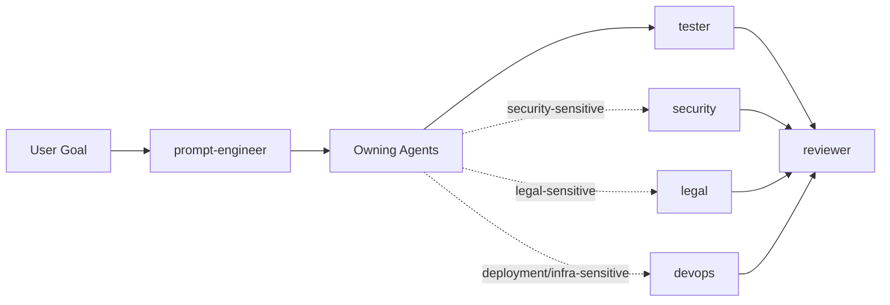

# VibeCoders Playbook

[](docs/index.html)
[](LICENSE)
[](AGENTS.md)

A production-minded, multi-agent operating layer you can drop into real projects.

> [!IMPORTANT]
> This repository is designed for reliable execution, not prompt theater.
> It enforces ownership, validation depth, and risk gates across Claude, GitHub Copilot, and Codex.

## Table Of Contents

- [What This Solves](#what-this-solves)
- [Architecture At A Glance](#architecture-at-a-glance)
- [Install In 60 Seconds](#install-in-60-seconds)
- [Execution Model](#execution-model)
- [Inter-Agent Handoff Contract](#inter-agent-handoff-contract)
- [Role Map](#role-map)
- [Production Baseline](#production-baseline)
- [Machine-Readable Entry Points](#machine-readable-entry-points)
- [Reference Catalog](#reference-catalog)
- [Docs Site](#docs-site)
- [License](#license)

## What This Solves

Without structure, agent-driven work usually fails in predictable ways:

- context overload
- ownership ambiguity
- weak runtime validation
- security/legal/devops review gaps
- noisy handoffs

VibeCoders Playbook addresses this with:

- explicit role ownership and escalation chains
- progressive context loading rules
- mandatory inter-agent handoff contract
- deploy-ready docs and CI checks
- assistant-specific packs for Claude, GitHub Copilot, and Codex

## Architecture At A Glance



> [!TIP]
> Default chain: prompt-engineer -> owner(s) -> tester -> reviewer.

## Install In 60 Seconds

### Standard install

<details>
<summary>PowerShell</summary>

```powershell
iex "& { $(irm https://raw.githubusercontent.com/YoussefSelk/VibeCode-PlayBook/main/scripts/install.ps1) }"
```

```powershell
iex "& { $(irm https://raw.githubusercontent.com/YoussefSelk/VibeCode-PlayBook/main/scripts/install.ps1) } -Destination 'C:\path\to\your\project'"
```

</details>

<details>
<summary>Bash</summary>

```bash
curl -fsSL https://raw.githubusercontent.com/YoussefSelk/VibeCode-PlayBook/main/scripts/install.sh | bash
```

```bash
curl -fsSL https://raw.githubusercontent.com/YoussefSelk/VibeCode-PlayBook/main/scripts/install.sh | bash -s -- --destination /path/to/your/project
```

</details>

### Assistant selection behavior

- interactive terminal: menu (codex / claude / github)
- non-interactive terminal: defaults to codex
- explicit override:
  - PowerShell: -Assistant codex|claude|github
  - Bash: --assistant codex|claude|github

### Overwrite options

- force overwrite:
  - PowerShell: -Force
  - Bash: --force
- create backups before overwrite:
  - PowerShell: -Backup
  - Bash: --backup

## Execution Model

### Load order (strict)

1. AGENTS.md
2. agent_docs/active_context.md
3. only the specific agent_docs files needed for the current pass

### Durable context files

- agent_docs/project_brief.md
- agent_docs/tech_stack.md
- agent_docs/active_context.md
- agent_docs/verification.md
- agent_docs/decisions.md

> [!NOTE]
> Keep context files short and current. Stale long docs burn tokens and reduce quality.

## Inter-Agent Handoff Contract

Every handoff must include all fields below.

| Field         | Why it exists                                     |
| ------------- | ------------------------------------------------- |
| goal          | Defines the exact objective for next owner        |
| scope         | Prevents drift outside files/symbols/flows        |
| changes       | Captures what is already done/investigated        |
| evidence      | Makes state reproducible (commands/tests/results) |
| risks         | Surfaces assumptions, blockers, open questions    |
| next-owner    | Removes ownership ambiguity                       |
| done-criteria | Defines objective finish gates                    |

### Handoff quality rules

- never hand off with vague text like "check this"
- always include reproducible validation steps
- when blocked, state blocker and smallest unblock path
- if contracts changed, call out impacted layers explicitly

## Role Map

| Role            | Ownership                                                |
| --------------- | -------------------------------------------------------- |
| prompt-engineer | turns rough asks into executable multi-agent prompts     |
| db              | schema, migrations, persistence contracts                |
| backend         | APIs, validation, business logic, auth                   |
| frontend        | UI, accessibility, client integration                    |
| devops          | CI/CD, deployment safety, environment, infra operability |
| tester          | runtime and cross-layer validation                       |
| security        | auth, secrets, trust boundaries, sensitive data          |
| legal           | privacy, consent, retention, policy-sensitive flows      |
| reviewer        | final regression and risk gate                           |

## Production Baseline

This repository includes production-friendly open source foundations:

- LICENSE
- CODE_OF_CONDUCT.md
- CONTRIBUTING.md
- SECURITY.md
- SUPPORT.md
- CHANGELOG.md
- CITATION.cff
- .github/CODEOWNERS
- .github/ISSUE_TEMPLATE/\*
- .github/PULL_REQUEST_TEMPLATE.md
- .github/dependabot.yml

And CI workflows:

- .github/workflows/deploy-pages.yml
- .github/workflows/installer-smoke-tests.yml
- .github/workflows/repo-production-readiness.yml

## Machine-Readable Entry Points

- docs/llms.txt
- docs/llms-full.txt
- docs/robots.txt
- docs/sitemap.xml

## Reference Catalog

Use this for objective-matched research links:

- .agents/reference-links.md

Categories include frontend, backend, databases, devops, security, testing, system design, prompt engineering, token optimization, memory management, vibe coding robustness, and more.

> [!TIP]
> Pull only the relevant section for the current task. Do not load the whole catalog by default.

## Docs Site

GitHub Pages-ready static site is in docs:

- docs/index.html
- docs/pages/getting-started.html
- docs/pages/reference.html
- docs/pages/ai-agents.html

Deployment:

- enable GitHub Pages in repo settings
- choose GitHub Actions as source
- push changes touching docs/ or deploy workflow

## License

MIT. See LICENSE.
